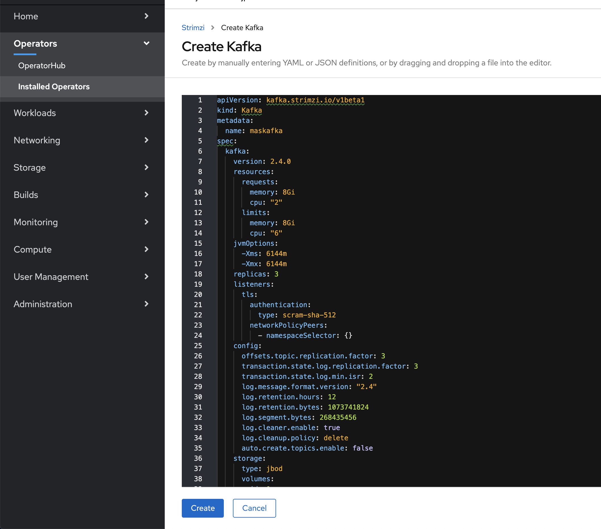
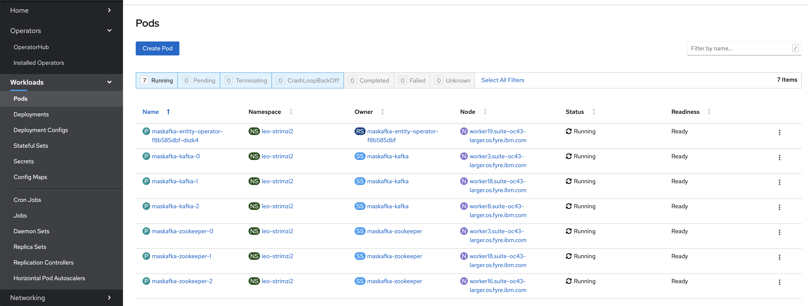
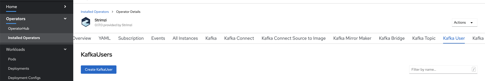
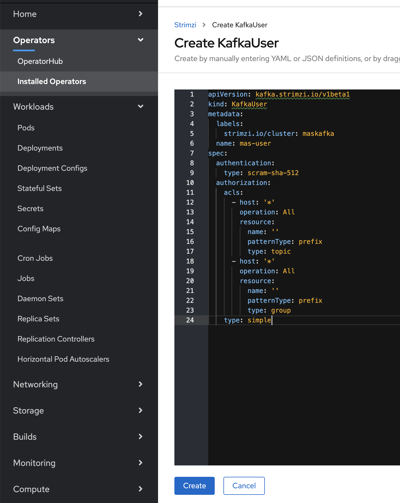

# Apache Kafka

## 1. How is Kafka used in Maximo Application Suite

Kafka forms an important part of the internal communications for services in the Maximo Application Suite.  A number of topics are created for a variety of purposes which are outlined in the following table:

| Topic | Purpose |
|--|--|
| `topic_events` | All device events are published to this internal topic.  They are processed by services that compute Device State models and forward events to other services (such as DB2).
| `actions_resolved_actions` | The rules engine service uses this topic to publish details of actions that need to be executed. |
| `internal_notification` | This topic is used by a number of services to send and receive notifications when certain resources are updated.  These notifications are used to trigger refreshing of various caches. |
| `topic_changes_devices` | Used by the device registry services to notify other components of device CRUD operations |
| `topic_changes_devicetypes` | Used by the device registry services to notify other components of device type CRUD operations |
| `topic_dr_device_notifications` | Used by the device registry services to notify other components of device CRUD operations |
| `topic_dr_devicetype_notifications` | Used by the device registry services to notify other components of device type CRUD operations |
| `topic_changes_apikeys` | Used by the authentication services to notify other components of apikey CRUD operations |
| `topic_changes_users` | Used by the authentication services to notify other components of user CRUD operations |
| `topic_changes_roles` | Used by the authentication services to notify other components of changes to role defintions |
| `topic_aaa_events` | Used by the authentication services to notify other components of permissions changes of users, apikeys or devices |
| `topic_im_internal_state_notifications` | Used by the Device state processing pipeline to track internal details of state updates|
| `topic_im_device_state_errors` | Used by the Device state processing pipeline to track information about errors that occur during runtime  |
| `topic_im_device_state_notifications` | Used by the Device state processing pipeline to track state changes that need to be published via MQTT |
| `im_rule_trigger_state_notifications` | Used by the rules engine services to track details of positive rule evaluations |
| `logmet_platform_notifications` | A general purpose notification topic |
| `topic_changes_orgs` | Used by the organization management services to notify other components of tenant updates |
| `topic_changes_configs` | Used by the configuration store to notify other components of organization configuration changes |


## 2. Supported Versions

The followong Kafka server version releases are supported:

- `2.3.X`
- `2.4.X`

## 3. Supported Deployment Details

### 3.1 Basic Cluster requirements

- 3 Zookeeper nodes
- 3 Kafka broker nodes
- TLS Endpoint for client connections
- SASL Authentication for client connections

### 3.2 Cluster Resource requirements

#### 3.2.1 Zookeeper Minimum Resource requirements per pod
 
|                      | Developer / Small | Medium / Large |
|----------------------|-------------------|----------------|
| **Zookeeper CPU**    | `500m`            | `1000m`        |
| **Zookeeper Memory** | `1Gi`             | `2G`           |

#### 3.2.2 Kafka Resource requirements per pod

|                      | Developer / Small | Medium / Large   |
|----------------------|-------------------|------------------|
| **Kafka CPU**        | `1000m`           | `2000m`          |
| **Kafka Memory**     | `4Gi`             | `8Gi`            |

## 4. Supported Authentication Methods

The Kafka cluster must provide an endpoint for client connections that uses SASL user authentication.  This must be configured with one of the following two SASL Mechanisms:

- PLAIN
- SCRAM-SHA-512

There must be at least one authenticated user in the Kafka Cluster.  This user must have permissions to:

- create topics
- create consumer groups
- publish to all topics
- subscribe and consume from all topics


## 5. Using the Strimzi operator

The Strimzi operator can be used to quickly, and simply, deploy a Kafka cluster into an OpenShift cluster.  This guide will provide sample resources that can be used with the Strimzi operator to achieve this.

### 5.1 Installing the Strimzi Operator

The simplest method for intallation is via the Operator Hub in the RedHat OpenShift Container Platform:


If you wish to manually install the operator, please refer to the Strimzi documentation [here](https://strimzi.io/docs/operators/master/using.html)

### 5.2 Defining a Storage Class

Before you can create the Kafka cluster you need to first define a Storage Class that will be used for Persistant Volume Claims.  The specific configuration of this Storage Class will be determined by the available Storage Providers in your OpenShift Cluster environment, however in order to be compatible with the subsequent example resources the Storage Class that you define should have the following name: `kafka-block-storage`

For example, the YAML defnition would start like this:


```YAML
kind: StorageClass
apiVersion: storage.k8s.io/v1
metadata:
  name: kafka-block-storage
```

### 5.3 Creating the Kafka Cluster

Once you have defined a Storage Class named `kafka-block-storgage` in your OpenShift Cluster you can now create the Kafka cluster resource.

The [`mas-kafka-cluster.yaml`](kafka-resources/mas-kafka-cluster.yaml) example file can be used to create a cluster Compatible with Maximo Application Suite.

To create the cluster via the Strimzi Operator User Interface, navigate to Operators->Installed Operators in the OpenShift Container Platform cosole and select the Strimzi Operator.  Then select "Kafka" from the available header sections, and click "Create Kafka":


On the subsequent dialogue, replace the YAML with the content of one of the following sample cluster specifications and then click "Create":

| Deployment Size   | Cluster Spec |
|-------------------|--------------|
| Developer / Small | [`mas-kafka-cluster.yaml`](kafka-resources/mas-kafka-cluster.yaml) |
| Medium / Large    | [`mas-kafka-cluster-large.yaml`](kafka-resources/mas-kafka-cluster-large.yaml) |



---

If will take a little time for all of the resources to be created and become ready.  Monitor the Pods and wait until you can see the entity operator pod, the three Zookeeper pods and the three Kafka pods _running_ and _ready_.  For example:



### 5.4 Creating a User for the Application Suite

Once the Kafka cluster is up and running, you can then create the user that will be utilised internally by the Maximo Application Suite.  Again, the simplest way to do this is using the provided YAML resource definition [`mas-kafka-user.yaml`](kafka-resources/mas-kafka-user.yaml).

To create the user vai the Strimzi Operater User Interface, navigate to the Operators->Installed Operators in the OpenShift Container Platform cosole and select the Strimzi Operator.  Then select "Kafka User" from the available header sections, and click "Create KafkaUser":




On the subsequent dialogue, replace the YAML with the content of the [`mas-kafka-user.yaml`](kafka-resources/mas-kafka-user.yaml) sample file and then click "Create":



Please note that it is important the `metadata.labels.strimzi.io/cluster` property of the `KafkaUser` resource *must* match the value of the `metadata.name` property of the `Kafka` resource that was previously created.  In the sample files this is `maskafka`.

## 6. Connection Details to use in Maximo App Suite initial setup

Part of completing the initial setup for the Maximo Application Suite will require you to provide the following details for the Kafka cluster:

- hosts
- username
- password
- SASL Authentication Mechanism

If you have used one of the provided sample cluster specifications, then the details will be as follows:

#### Hosts

There will be three hosts, each with the following hostname format:

`<cluster-name>-kafka-<n>.<cluster-name>-kafka-brokers.<project-namespace>.svc`

Where:

- `<cluster-name>` is the name of the Kafka cluster (i.e the value of `metadata.name` in the Kafka resource specification)

- `<project-namespace>` is the Project namespace into which the Kafka cluster was deployed (i.e the value of `metadata.namespace` in the Kafka resource specification)

- `<n>` is a zero indexed range of numbers determined by the number of Kafka pods in the cluster (3 if you used the sample cluster specs)

For example.  If the cluster name is `maskafka` and it was deployed into a project namespace of `prereqs`, then the hosts for a three node Kafka cluster would be:

- `maskafka-kafka-0.maskafka-kafka-brokers.prereqs.svc`
- `maskafka-kafka-1.maskafka-kafka-brokers.prereqs.svc`
- `maskafka-kafka-2.maskafka-kafka-brokers.prereqs.svc`

In all cases, the port to use will be `9093`

#### Username / Password

If you have used the provided Kafka user resource specification sample, then the username will be `mas-user` and the password can be found in a Kubernetes secret with the same name (in the project namespace that the Cluster and user were created in)

#### SASL Authentication Mechanism

If you have used one of the provided sample cluster specifications, then the SASL authentication mechanism will be `SCRAM-SHA-512`